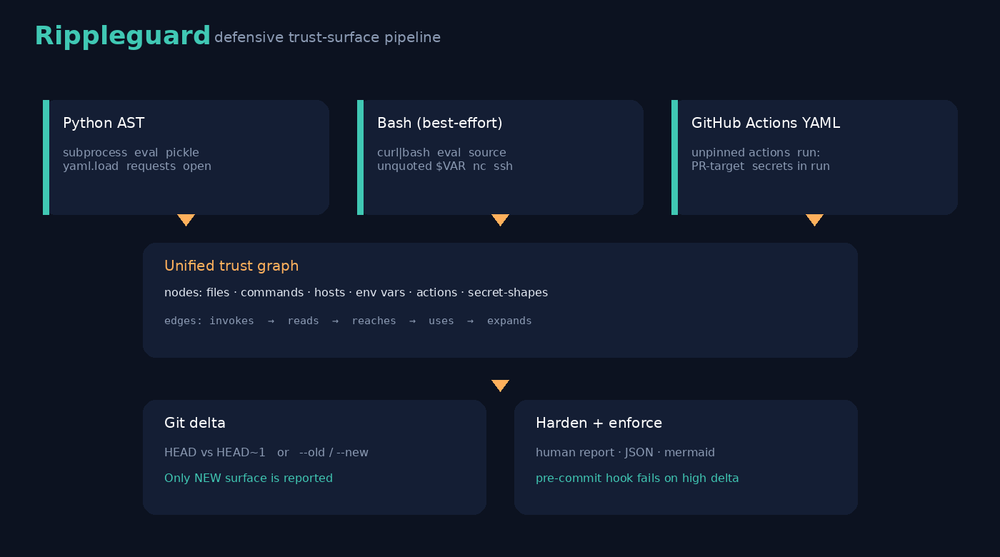
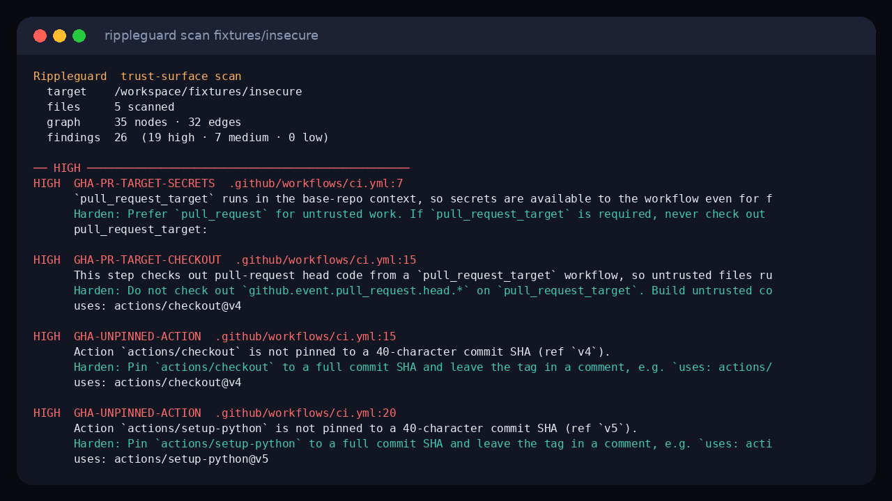

# Rippleguard

Rippleguard maps a repository's **trust surface** across three languages at once: **Python**, **Bash**, and **GitHub Actions YAML**. It builds a graph of what the code can execute, which files and environment variables it can read, and which hosts it mentions. Then it **diffs that graph across git history**, so a commit that quietly adds `curl | bash`, `subprocess(..., shell=True)`, or a CI secret-to-step leak shows up as a surface expansion.

This is not a CVE scanner and not a linter clone. The product is the **cross-language execution graph + git delta**.

It is **defensive only**. Findings tell a maintainer how to harden their own code (safer API, quote the expansion, drop `shell=True`, pin an action by SHA). They never describe how to abuse a finding. Secret-shaped values are reported as a *shape and file location*; the value is redacted.



<p align="center"></p>

## Why this is novel

Most tools look at one language, or they grep for CVEs. Rippleguard:

1. Parses Python (AST), Bash (best-effort), and GitHub Actions workflows into the **same graph** (files, commands, hosts, env, actions).
2. Treats **git history** as the interesting axis: `rippleguard diff` prints only *new* surface.
3. Enforces that delta with a **Bash pre-commit / pre-push hook** that fails on high-severity expansions.
4. Makes **zero network calls** at runtime (optional `--allow-network` is reserved and still does not fetch). Hosts are recorded from literals only.

## Install

Python 3.11+ and a local `git` for `diff` / the hook.

```bash
git clone https://github.com/rashedhasan090/rippleguard.git
cd rippleguard
python3 -m venv .venv
source .venv/bin/activate
pip install -e .
rippleguard --version
```

## Tutorial

A short video of the same steps lives at [`docs/tutorial.mp4`](docs/tutorial.mp4). A text transcript is [`docs/TUTORIAL.md`](docs/TUTORIAL.md).

<video src="docs/tutorial.mp4" controls width="720" title="Rippleguard tutorial"></video>

### 1. Clone and install

```bash
git clone https://github.com/rashedhasan090/rippleguard.git
cd rippleguard
python3 -m venv .venv
source .venv/bin/activate
pip install -e .
```

### 2. Scan the insecure fixtures

`fixtures/insecure/` is a **labeled demo of patterns to detect**. It is not an exploit and should not be executed against any system.

```bash
rippleguard scan fixtures/insecure
```

Expected: **exit code 1**, multiple findings with `file:line`, including IDs such as `PY-SUBPROCESS-SHELL`, `SH-CURL-BASH`, `GHA-UNPINNED-ACTION`, `GHA-SECRET-IN-RUN`, and `SECRET-SHAPE`.



### 3. Read the graph

The default text report includes a **mermaid** flowchart (nodes + `invokes` / `reads` / `reaches` / `uses` edges) and a JSON document of the same scan. Paste the mermaid block into GitHub markdown preview to see how Python, Bash, and the workflow share hosts and commands.

JSON only:

```bash
rippleguard scan fixtures/insecure --json
```

### 4. Diff a trust-surface expansion

Path mode (no git required) — this is the “fixed → insecure” expansion:

```bash
rippleguard diff --old fixtures/fixed --new fixtures/insecure
```

Expected: **exit code 1**, only *new* findings (the delta).

Against git history (HEAD vs previous commit, or any refs):

```bash
rippleguard diff . --base HEAD~1 --head HEAD
```

### 5. Confirm the hardened fixtures

```bash
rippleguard scan fixtures/fixed --fail-on high
```

Expected: **exit code 0** for high severity. The fixed tree uses argv lists, `yaml.safe_load`, quoted expansions, Actions pinned by full SHA, and secrets mapped through `env:` instead of interpolating `${{ secrets.* }}` into `run:`.

### 6. Install the Bash hook

The companion `rippleguard-hook` fails a commit or push when the trust-surface **delta** introduces high-severity expansions.

```bash
rippleguard hook install --pre-commit
# optional:
rippleguard hook install --pre-push
```

Or copy the script yourself (it is also shipped at `scripts/rippleguard-hook`):

```bash
chmod +x scripts/rippleguard-hook
cp scripts/rippleguard-hook .git/hooks/pre-commit
```

The hook locates the `rippleguard` CLI (PATH, `.venv`, or `python3 -m rippleguard`) and runs `rippleguard hook run --mode pre-commit`.

## CLI

| Command | What it does | Exit codes |
| --- | --- | --- |
| `rippleguard scan [path]` | Human report + JSON + mermaid | `0` clean, `1` high-severity surface, `2` tool error |
| `rippleguard diff [path] [--base REF] [--head REF]` | New surface vs a git ref (default `HEAD~1` → working tree) | same |
| `rippleguard diff --old DIR --new DIR` | New surface between two trees | same |
| `rippleguard hook install` | Install `pre-commit` (and `--pre-push`) | `0` / `2` |
| `rippleguard hook run --mode pre-commit` | What the Bash hook calls | `0` / `1` / `2` |

Useful flags: `--json`, `--no-mermaid`, `--no-json-block`, `--exclude PREFIX` (repeatable), `--fail-on high|medium|low|none`.

`--allow-network` defaults **off**. This version never opens sockets; the flag only records that you opted in.

## Finding catalog (selected)

| ID | Language | Harden (summary) |
| --- | --- | --- |
| `PY-SUBPROCESS-SHELL` | Python | Pass an argv list; keep `shell=False` |
| `PY-OS-SYSTEM` | Python | Replace `os.system` with `subprocess.run([...])` |
| `PY-EVAL` / `PY-EXEC` | Python | Use `ast.literal_eval` or an allowlisted dispatcher |
| `PY-PICKLE` | Python | Prefer `json`; do not unpickle untrusted bytes |
| `PY-YAML-LOAD` | Python | `yaml.safe_load` |
| `PY-URL-REQUEST` | Python | Allowlist hosts; leave TLS verify on |
| `PY-ENV-FILE` | Python | Keep env files gitignored; never log contents |
| `SH-CURL-BASH` / `SH-WGET-SH` | Bash | Download, verify a pinned checksum, then run |
| `SH-EVAL` | Bash | Function call or allowlisted argv; no `eval` |
| `SH-UNQUOTED-EXPAND` | Bash | Quote `"${name}"` |
| `SH-SOURCE-RELATIVE` | Bash | Anchor at `"${BASH_SOURCE[0]%/*}"` |
| `GHA-UNPINNED-ACTION` | Actions | Pin `uses:` to a 40-character SHA |
| `GHA-CURL-PIPE` | Actions | Do not `curl \| sh` in `run:` |
| `GHA-PR-TARGET-CHECKOUT` | Actions | Do not check out PR heads on `pull_request_target` |
| `GHA-SECRET-IN-RUN` | Actions | Map secrets through `env:`, never `${{ secrets.* }}` inside `run:` |
| `SECRET-SHAPE` | any | Rotate if real; report is shape + path only (value redacted) |

## Tests

```bash
pip install -e ".[dev]"
pytest
```

Tests scan `fixtures/insecure` and `fixtures/fixed`, assert expected finding IDs, and build a temporary git repo to exercise `rippleguard diff --base HEAD~1 --head HEAD`.

## Dogfood CI

[`.github/workflows/rippleguard.yml`](.github/workflows/rippleguard.yml) installs this package and runs `rippleguard scan` on the product sources (fixtures excluded). A second job proves the insecure fixtures still fail the scan and that unit tests pass. Actions are pinned by SHA.

## License

[MIT](LICENSE)
